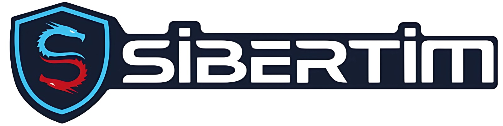

  

# sibertim.com İçerikleri

Bu depo, **sibertim.com** için hazırlanmış siber güvenlik eğitim ve rehber içeriklerini barındırır. İçerikler, siber güvenlik alanında bilgi edinmek, pratik yapmak ve çeşitli araçların kullanımını öğrenmek isteyenler için derlenmiştir.

---

## 1. Giriş

Bu klasör, siber güvenlik çalışmalarına başlamadan önce temel bilgileri ve kurulum rehberlerini içerir. Sanal makine kurulumları, temel testler ve Kali Linux hakkında dökümanlar burada yer alır.

**İçerik Listesi:**
- 1.Giriş.docx
- 2.Kali_Linux_Temel_Bilgiler.docx
- 2.Kali_Linux_Temel_Bilgiler2.docx
- 2.Siyah_Beyaz_Gri_Kutu_Testleri.docx
- 3.Kali Linux Live USB Kılavuzu.docx
- 3.UTM Üzerine Kurulumu.docx
- 3.VMware Workstation Üzerine Kurulumu.docx
- 3.Virtual Box Üzerine Kurulumu.docx
- Kali_Purple_Egitim_Materyali.docx

---

## 2. Bilgi Toplama

Bu klasör, siber güvenlikte bilgi toplama (reconnaissance) aşamasında kullanılan araç ve yöntemlere dair dökümanları içerir. Alt klasörler aşağıdaki gibidir:

### 1. Alan Adı ve Subdomain Keşfi
- Amass.docx
- AssetFinder.docx
- Crtsh_Httpx.docx
- Dnsenum.docx
- DNSx Nedir.docx
- Findomain.docx
- ReconFTW_Kullanim_Kilavuzu.docx
- Subfinder.docx
- SUBLİST3R.docx

### 2. E-posta ve İnsan Bilgisi Toplama (OSINT)
- Email_Format_com.docx
- Hunter_io.docx
- Linkedin.docx
- RECON.NG.docx
- theharvester.docx
- Pish Nedir.docx
- SocialFish Nedir.docx
- Weeman Nedir.docx
- Weeman Nedir..........docx
- GOPHİSH.docx
- EVİLGİNX2.docx

### 3. Açıkta Kalmış Dosya ve Endpoint Bulma
- gau(getallUrls).docx
- Goofile.docx
- Paramspider.docx
- waybackurls.docx
- google dorking.docx

### 4. Ağ, IP ve Servis Bilgisi Toplama
- CENSYS.docx
- DMİTRY.docx
- SHODAN .docx
- WHATWEB  WAPPALYZER.docx

### 5. Web Uygulaması ve WAF Tespiti
- Httprobe_vs_httpx.docx
- WafW00f.docx

### 6. Görsel OSINT  Haritalama
- Maltego.docx
- Metagoofil.docx
- SpiderFoot.docx
- EvilURL Nedir.docx
- Lampyre Nedir ve Kurulumu.docx
- Creepy Nedir ve Kurulumu.docx

### 7. Zafiyet Arşivi ve Exploit Veritabanı
- ExploitDB_SearchSploit_Rehber.docx
- GitHub_Zafiyet_POC_OSINT.docx
- Vulners_Zafiyet_Veritabani.docx

### Diğer
- Arjun Nedir.docx
- ceWL.docx
- GetJS.docx
- Fierce.docx
- GF.docx
- Hakrawler Nedir.docx
- SecLists Nedir.docx
- WordlistRaider Nedir.docx
- FuzzDB Nedir.docx
- AWSBucketDump Nedir.docx
- CloudBrute Nedir.docx
- FalconHound Nedir ve Kurulumu.docx
- RedELK Nedir ve Kurulumu.docx

---

## 3. Ağ, Port Tarama ve Keşif Yöntemleri

Bu klasör, ağ keşfi ve port tarama işlemlerinde kullanılan temel araçlara dair rehberleri içerir.

**İçerik Listesi:**
- CrackMapExec.docx
- Hping3.docx
- IP Attack Nedir.docx
- Kiterunner Nedir.docx
- LEGO (Let's Encrypt) Nedir.docx
- Masscan.docx
- Netdiscover Nedir.docx
- Nmap.docx
- RustScan Nedir.docx
- Shcheck Nedir.docx
- ZMap Nedir.docx
- SSL Araçları/
  - SSL SCANNER .docx
  - STRİCERT.docx

---

## 4. Web Uygulama Tarayıcısı

**İçerik Listesi:**
- BBHT.docx
- x8 Aracı Nedir.docx
- Fimap Nedir _.docx
- jSQL Injection Aracı Nedir _.docx
- Rengine Nedir.docx
- SQLMap Nedir _.docx
- Vulmap Nedir _.docx
- ZAP CLI Nedir.docx
- XSSer Nedir.docx
- burp-suite.docx
- nuclei.docx
- RED HAWK.docx
- NİKTO.docx
- D-TECT.docx
- Clickjacking Nedir.docx
- W3af.docx
- Vega.docx
- owasp-zap.docx
- JoomScan.docx
- dalfox.docx
- dirsearch.docx
- FFUF.docx
- wapiti.docx
- wpScan.docx
- XSStrike.docx

---

## 5. Web Uygulama İstismar Araçları

**İçerik Listesi:**
- Metasploit Framework Nedir _.docx
- Exploit-DB Mirror Nedir _.docx
- websploit.docx
- Metasploit.pptx

---

## 7.Yerel Ağ Saldırıları

Bu klasör, yerel ağda yapılan saldırı teknikleri ve araçlarına dair rehberleri içerir.

**İçerik Listesi:**
- ARP Spoofing ve SSLstrip ile Araya Girme.docx
- Bettercap.docx
- CHISEL.docx
- Ettercap Nedir.docx
- Girilen Web Sitelerini Loglama (Ağ Trafiği İzleme.docx)
- IMPACKET.docx
- MITMf Nedir.docx
- RESPONDER.docx
- tcpdump.docx
- wireshark kullanımı.docx

---

## 8.Kablosuz Ağlara Yönelik Saldırılar

Bu klasör, kablosuz ağlara yönelik saldırı teknikleri ve araçlarına dair rehberleri içerir.

**İçerik Listesi:**
- WPAWPA2 AĞLARINA YÖNELİK SALDIRILAR .docx
- WEP ağlarına yönelik saldırılar.docx
- gizli ağları bulma.docx
- Ghost Phisher .docx

---

## 9.Parola Saldırı ve Kırma Araçları

**İçerik Listesi:**
- Atomic Red Team Nedir.docx
- BadBlood_AD_Egitim_Materyali.docx
- GhostPack_Egitim_Materyali.docx
- Invoke_Obfuscation_Egitim_Materyali.docx
- linPEAS winPEAS Nedir.docx
- PEASS-ng Nedir.docx
- BloodHound Nedir _.docx
- firecrack.docx
- findMyhash.docx

---

## 10.Forensic Araçları

**İçerik Listesi:**
- Alterx Nedir.docx
- Arkime Nedir.docx
- Arkime_Moloch_Egitim_Materyali.docx
- Autopsy.docx
- Binwalk Nedir.docx
- Bulk Extractor Nedir.docx
- CAPE Sandbox Nedir.docx
- Cado Community Tools Nedir ve Kurulumu.docx
- CyberChef.docx
- ExifScan Nedir ve Kurulumu.docx
- Exiftool.docx
- Falco Nedir ve Kurulumu.docx
- Ghidra.docx
- HELK Nedir ve Kurulumu.docx
- LogonTracer_Egitim_Materyali.docx
- OpenSnitch Nedir ve Kurulumu.docx
- OSQuery Nedir ve Kurulumu.docx
- Plaso.docx
- RedLine Stealer Nedir.docx
- Security_Onion Nedir ve Kurulum.docx
- Sigma Nedir.docx
- Snort Nedir.docx
- Sysmon + SysmonView Nedir ve Kurulumu.docx
- Sysmon_Modular_Configs_Egitim_Materyali.docx
- ThreatHunting_Project_Egitim_Materyali.docx
- Vector Loki Stack Nedir ve Kurulumu.docx
- Velociraptor Nedir.docx
- volatility.docx
- Wazuh Nedir ve Kurulumu.docx
- YARA Araci.docx

---

## 12.Web Shell ve Arka Kapı Araçları

**İçerik Listesi:**
- Brute_Ratel_C4_eğitim_materyali.docx
- Caldera_MITRE_Egitim_Materyali.docx
- Covenant_C2_Egitim_Materyali.docx
- Mythic_C2_Egitici_Materyal.docx
- PoshC2_Egitim_Materyali.docx
- Python_Empire_Egitim_Materyali.docx
- Webponized.docx
- weevely.docx

---

## logo

- logo.jpg

---

## Diğer Kaynaklar ve Belgeler

- pentesting-steps-tools.pdf (www.linkedin.com/in/yusabas)

---

Katkıda bulunmak isteyenler, yeni içerik ekleyebilir veya mevcut içerikleri güncelleyebilir. Lütfen katkı yapmadan önce bir issue açınız.

Tüm içerikler eğitim amaçlıdır. İzinsiz çoğaltılamaz veya ticari amaçla kullanılamaz.

---

Daha fazla bilgi için [sibertim.com](https://sibertim.com) adresini ziyaret edebilirsiniz.
